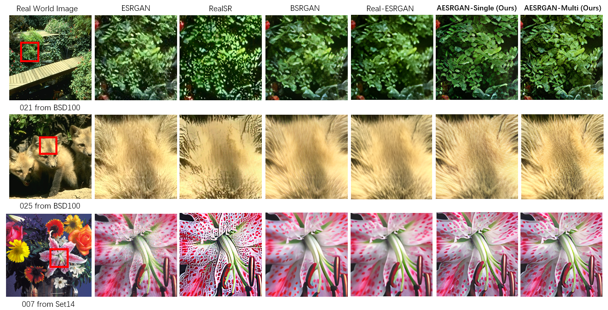
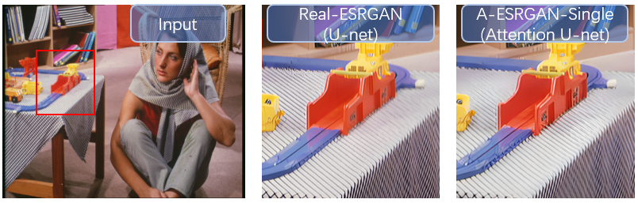
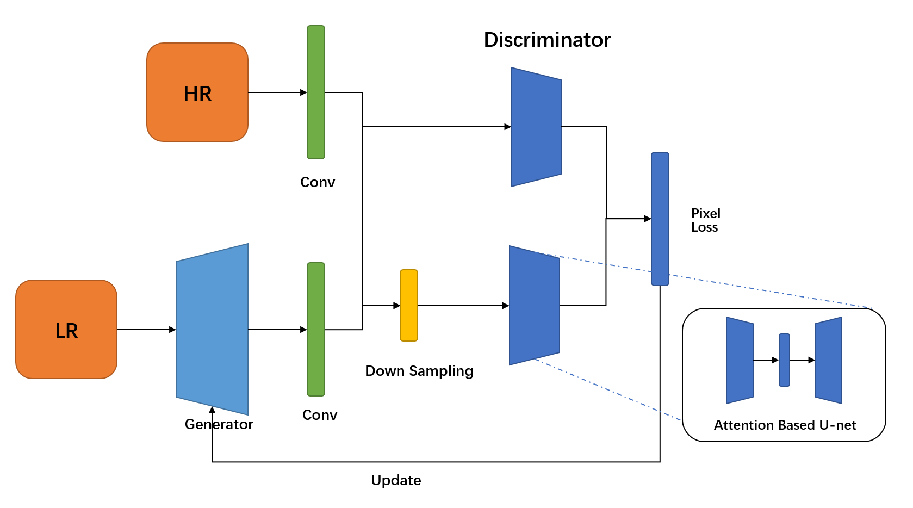
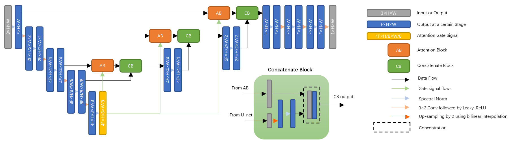
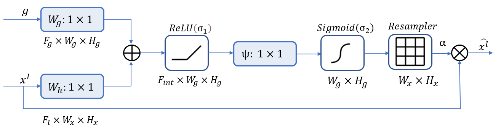
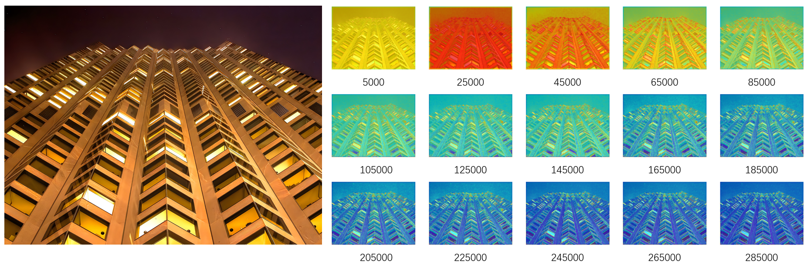
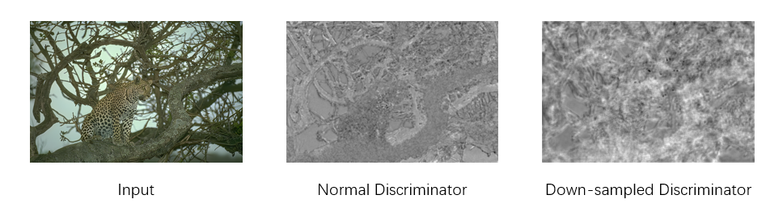
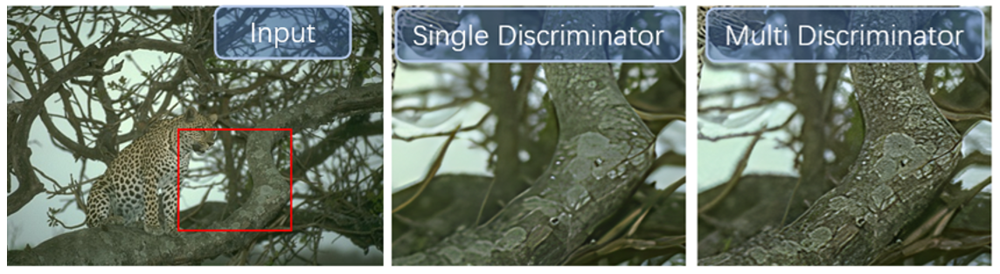
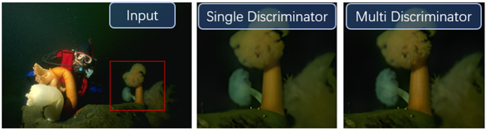
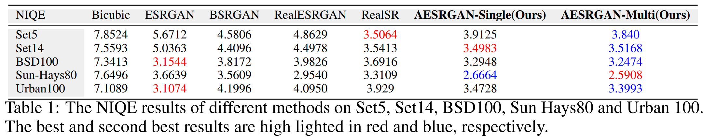

# A-ESRGAN: Training Real-World Blind Super-Resolution with Attention-based U-net Discriminators


<p align="center">
  
</p>


## Main idea

Introduce attention U-net into the field of blind real world image super resolution. We aims to provide a super resolution method with sharper result and less distortion.  

#### Sharper:

<p align="center">
  
</p>

#### Less distortion:

<p align="center">
  
</p>


## Network Architecture

The **overall architecture** of the A-ESRGAN:

<p align="center">
  
</p>

The architecture of a single **attention U-net discriminator**:

<p align="center">
  
</p>

The **attention block** is modified from 3D attention U-net's attention gate:

<p align="center">
  
</p>

## Attention Map

We argue it is the attention map that plays the main role in improving the quality of super resolution images. To support our idea, we visualize how the attention coefficients changes in time and space.

We argue that during the training process the attention will gradually focus on regions where color changes abruptly, i.e. **edges**. And attention layer in different depth will give us edges of different **granularity**.

#### Attention coefficients changes across time.

<p align="center">
  
</p>

#### Attention coefficients changes across space.

<p align="center">
  
</p>


## Multi Scale

Multi scale discriminator has to learn whether parts of the image is clear enough from different receptive fields. From this perspective, different discriminator can learn complementary knowledge. From the figure below, normal discriminator learn to focus on edges, while down-sampled discriminator learn patch-like patterns such as textures.

  <p align="center">
  
</p>

Thus, comparing with the single attention u-net discriminator, multi-scale u-net discriminator can generate more realistic and detailed images.

#### Better Texture:

  <p align="center">
  
</p>

  <p align="center">
  
</p>

## Test Sets

The datasets for test in our A-ESRGAN model are the standard benchmark datasets Set5, Set14, BSD100, Sun-Hays80, Urban100. Noted that we directly apply 4X super resolution to the original real world images and use NIQE to test the perceptual quality of the result.  As shown in the figure below, these 5 datasets have covered a large variety of images.

<p align="center">
  
</p>

A combined dataset can be find in [DatasetsForSR.zip](https://github.com/aergan/A-ESRGAN/releases/download/v1.0.0/DatasetsForSR.zip).

We compare with ESRGAN, RealSR, BSRGAN, RealESRGAN on the above 5 datasets and use NIQE as our metrics. The result can be seen in the table below:

<p align="center">
  
</p>

Note a **lower** NIQE score shows a better perceptual quality.

## Quick Use

#### **Inference Script**

**!** We now only provides 4X super resolution now.

Download pre-trained models: [A-ESRGAN-Single.pth](https://github.com/aesrgan/A-ESRGAN/releases/download/v1.0.0/A_ESRGAN_Single.pth) to the `experiments/pretrained_models`.

```bash
wget https://github.com/aergan/A-ESRGAN/releases/download/v1.0.0/A_ESRGAN_Single.pth
```

Inference:

```bash
python inference_aesrgan.py --model_path=experiments/pretrained_models/A_ESRGAN_Single.pth --input=inputs
```

Results are in the `results` folder

#### NIQE Script

The NIQE Script is used to give the Mean NIQE score of a certain directory of images.

Cacluate NIQE score:

```bash
cd NIQE_Script
python niqe.py --path=../results
```

#### Visualization Script

The Visualization Script is used to visualize the attention coefficient of each attention layer in the attention based U-net discriminator. It has two scripts. One script `discriminator_attention_visual(Single).py`  is used to visualize how the attention of each layer is updated during the training process on a certain image. Another Script `combine.py` is used to combine the heat map together with original image.

Generate heat maps:

First download [single.zip](https://github.com/aesrgan/A-ESRGAN/releases/download/v1.0.0/single.zip) and unzip to `experiments/pretrained_models/single`

```bash
cd Visualization_Script
python discriminator_attention_visual(Single).py --img_path=../inputs/img_015_SRF_4_HR.png
```

The heat maps will be contained in `Visualization_Script/Visual`

If you want to see how the heat map looks when combining with the original image, run:

```
python combine.py --img_path=../inputs/img_015_SRF_4_HR.png
```

The combined images will be contained in  `Visualization_Script/Combined`

**!** **Multi-scale discriminator attention map visualization:**

Download [multi.zip](https://github.com/aesrgan/A-ESRGAN/releases/download/v1.0.0/multi.zip) and  unzip to `experiments/pretrained_models/multi`

Run  `discriminator_attention_visual(Mulit).py` similar to  `discriminator_attention_visual(Single).py`.

**!See what the multi-scale discriminator output**

Run `Multi_discriminator_Output.py` and you could see the visualization of pixel-wise loss from the discriminators.

**!** **Note** we haven't provided a combined script for multi attention map yet.

## Model_Zoo

The following models are the **generators**, used in the A-ESRGAN

- [A_ESRGAN_Multi.pth](https://github.com/aergan/A-ESRGAN/releases/download/v1.0.0/A_ESRGAN_Multi.pth): X4 model trained with multi scale U-net based discriminators.
- [A_ESRGAN_Single.pth](https://github.com/aergan/A-ESRGAN/releases/download/v1.0.0/A_ESRGAN_Single.pth): X4 model trained with a single U-net based discriminators.
- [RealESRNet_x4plus.pth](https://github.com/aergan/A-ESRGAN/releases/download/v1.0.0/RealESRNet_x4plus.pth): official Real-ESRNet model (X4), where A-ESRGAN is fine-tuned on.

The following models are **discriminators**, which are usually used for fine-tuning.

- [A-ESRGAN-Mult_D.pth](https://github.com/aergan/A-ESRGAN/releases/download/v1.0.0/A-ESRGAN_Multi_D.pth)
- [A-ESRGAN-Single_D.pth](https://github.com/aergan/A-ESRGAN/releases/download/v1.0.0/A_ESRGAN_Single_D.pth)

The following models are the **checkpoints** of discriminators during A-ESRGAN training process, which are provided for visualization attention.  

- [Single(net_d_5000.pth -> net_d_350000.pth)](https://github.com/aergan/A-ESRGAN/releases/download/v1.0.0/single.zip)
- [Multi(net_d_5000.pth -> net_d_185000.pth)](https://github.com/aergan/A-ESRGAN/releases/download/v1.0.0/multi.zip)

## Training and Finetuning on your own dataset

We follow the same setting as RealESRGAN, and a detailed guide can be found in [Training.md](Training.md).


# Acknowledgement

Our implementation of A-ESRGAN is based on the [BasicSR ](https://github.com/xinntao/BasicSR)and [Real-ESRGAN](https://github.com/xinntao/Real-ESRGAN).

